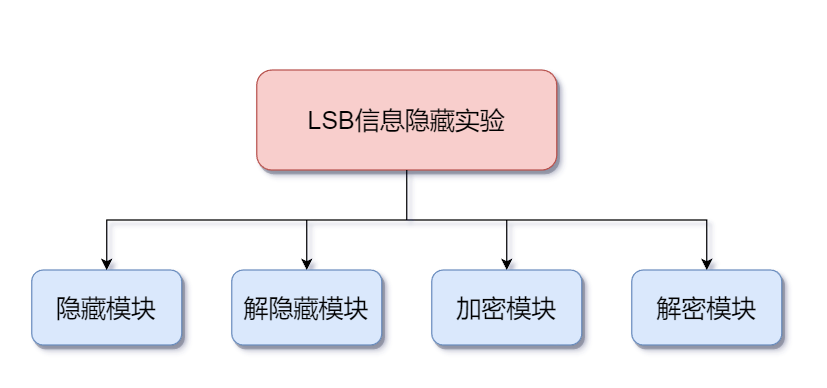
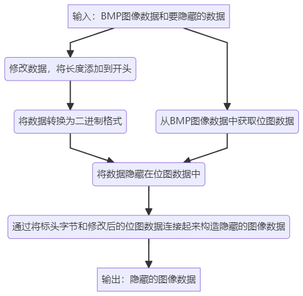
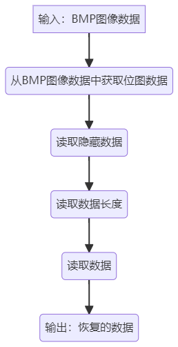
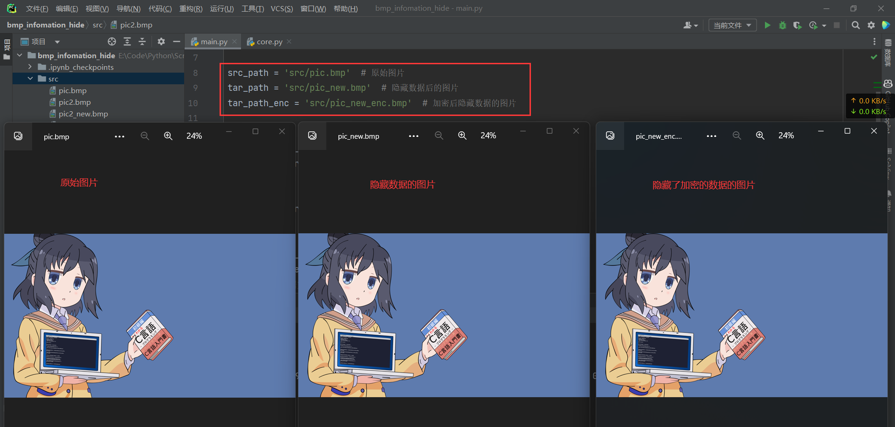
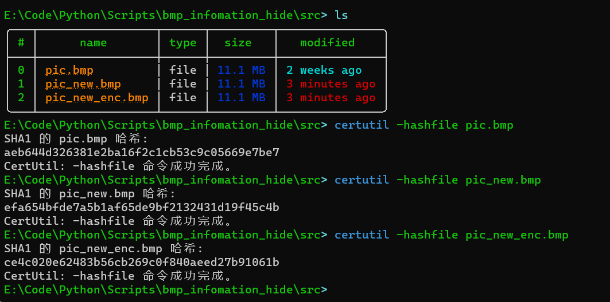

# 系统功能描述

写一个小程序，实现如下基本功能：

1. 将指定的文本信息隐藏到24位位图中，输出携密图片，比
   较原始图像和携密图像；
2. 从1产生的携密图像文件中恢复隐秘的文本信息；
3. 在完成1、2的基础上，先对待隐藏的文本信息加密，然后
   将密文隐藏到24位位图中；
4. 从3产生的携密图像文件中恢复出隐秘的文本信息。

# 系统设计

## 系统模块划分

## 模块接口

| 模块名      | 模块参数                     | 模块返回值 | 解释                                                         |
| ----------- | :--------------------------- | ---------- | :----------------------------------------------------------- |
| hide_lsb    | bmp: bytes, data: bytes      | bytes      | 将一个字节流类型的bmp图片数据和一个字节流类型的data数据进行处理，将data数据通过将其转换为二进制字符串，并嵌入bmp图片数据中的LSB（Least Significant Bit）中来隐藏起来，返回隐藏后的bmp图片数据，其中隐藏的数据前四个字节表示数据长度。 |
| restore_lsb | bmp: bytes                   | bytes      | 从一个字节流类型的bmp图片数据中提取隐藏在其LSB中的数据，并返回提取出来的数据。其中，隐藏的数据前四个字节表示数据长度。 |
| aes_encrypt | data: bytes, key: bytes | bytes      | 对一个字节流类型的数据进行AES加密，使用SHA256哈希函数将key生成256位密钥，然后对数据进行填充（填充长度为16字节的倍数），使用加密模式为ECB的AES算法进行加密，并返回加密后的数据。 |
| aes_decrypt | data: bytes, key: bytes | bytes      | 对一个字节流类型的数据进行AES解密，使用SHA256哈希函数将key生成256位密钥，使用解密模式为ECB的AES算法进行解密，然后去除填充数据，并返回解密后的数据。 |

# 详细设计

## 隐藏模块: hide_lsb

## 恢复模块: restore_lsb

# 测试

如图: 第一张图片是原图, 第二张图片是隐藏数据的图片, 第三图片是隐藏了加密数据的图片

显然, 三张图片肉眼看不出差别

利用文件哈希检查, 三张图片的hash值各不相同, 说明文件确实被修改了

控制台输出也显示成功隐藏和恢复数据

实验成功!
