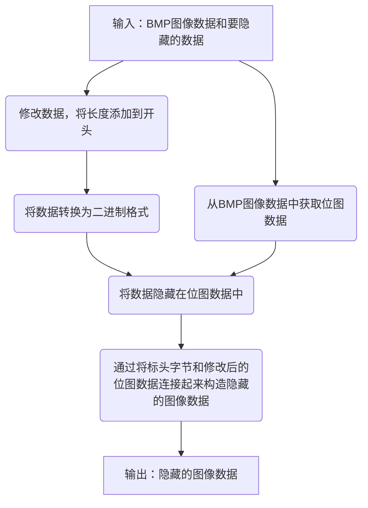
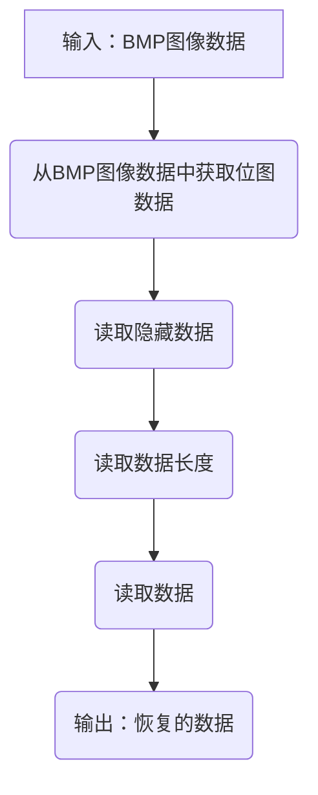

## 隐藏模块: hide_lsb

```mermaid
graph TD
    A["输入：BMP图像数据和要隐藏的数据"] --> B("修改数据，将长度添加到开头")
    B --> C(将数据转换为二进制格式)
    A --> D(从BMP图像数据中获取位图数据)
    C --> E(将数据隐藏在位图数据中)
    D --> E
    E --> F(通过将标头字节和修改后的位图数据连接起来构造隐藏的图像数据)
    F --> G["输出：隐藏的图像数据"]

```

## 恢复模块: restore_lsb

```mermaid
graph TD
    A["输入：BMP图像数据"] --> B(从BMP图像数据中获取位图数据)
    B --> C(读取隐藏数据)
    C --> D(读取数据长度)
    D --> F(读取数据)
    F --> G("输出：恢复的数据")

```

# 